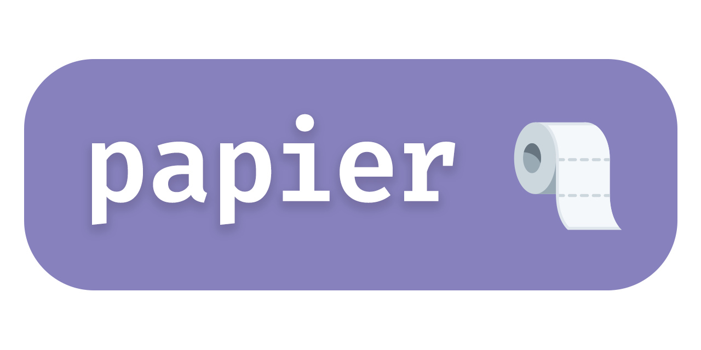

<p align="center">
    
</p>

[](https://crates.io/crates/rwalk)
[](https://github.com/cestef/rwalk/releases/latest)
[](LICENSE)


A perfectly inconvenient text editor, written in Rust.

## Installation

### Cargo

```sh
cargo install papier
```

### Homebrew

```sh
brew install cestef/tap/papier
```

<p align="center">
    <small>
        You can also download the latest release from the <a href="https://github.com/cestef/papier/releases">releases page</a>.
    </small>
    
</p>

## Acknowledgements

This project heavily relies on the amazing [edtui](https://github.com/preiter93/edtui) library. It uses a modified version of the library to fit the needs of this project. (See [the README](crates/edtui/README.md) for more information.)